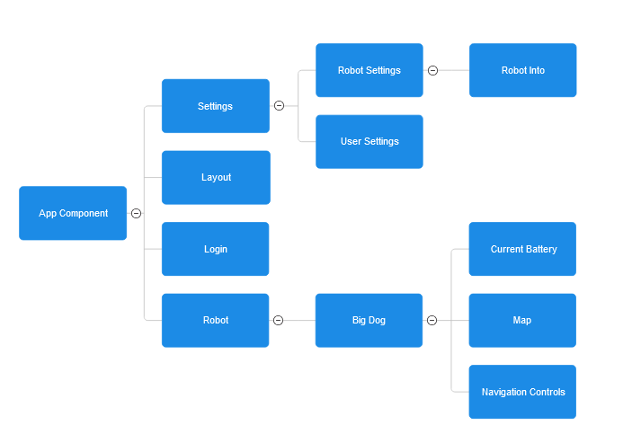

# Shroom UI
A Mushroom Picking Robot fleet management web application made using Angular and a Python script to run on a Raspberry Pi connected to the robot.

Using a Angular Frontend, ExpressJS Backend, and PostgreSQL database.

# Installation/Startup Guide
RPiConnect.py is meant for a Raspberry Pi to connect to the Big Dog. Please ensure that the Raspberry Pi is on the same 

If running on a Raspberry Pi with a GUI, please open and run with the integrated IDE or through the command line.


If running the web application, cd into the my-app


Node Version requirement
```
version >= 20.12
```

1. Install Packages
```
npm install
```
Installs all required modules/dependencies.

### Scripts
```
npm start
```
This will let you run the site locally in development mode.
Ideal for testing and non-production run.
Please ensure that http://localhost:3000 and http://localhost:4200 are available.

## File Layout


Parent Components -> Child Components

## Notes
* RPiConnect.py script must be run on a device connected to the same network as the Big Dog robot. The web app does not have to be on the same network.


